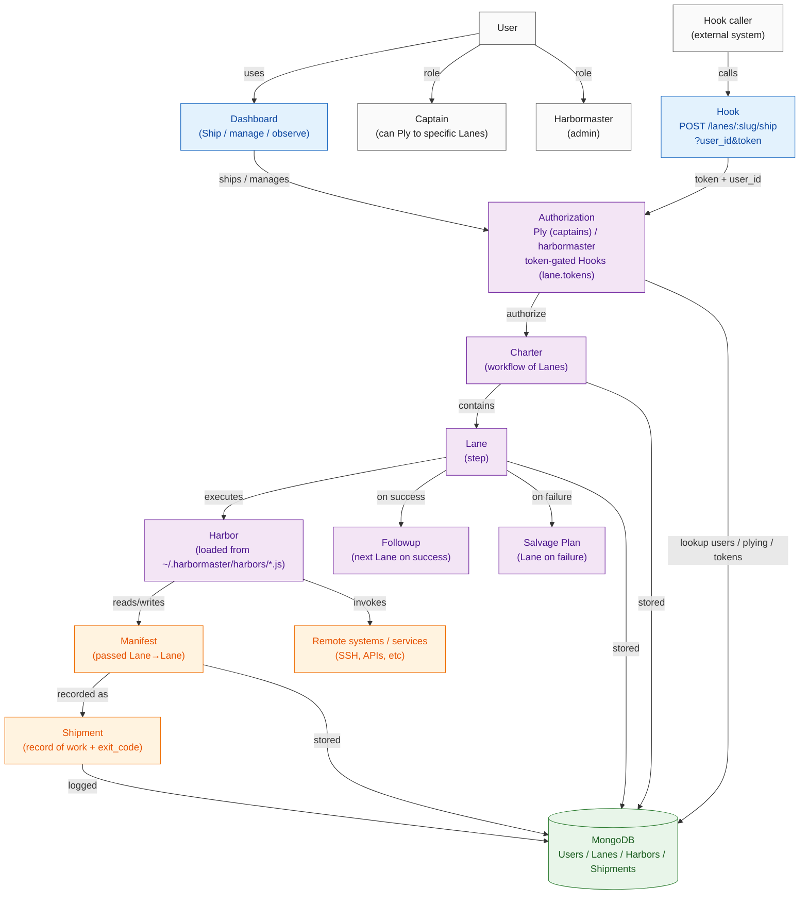
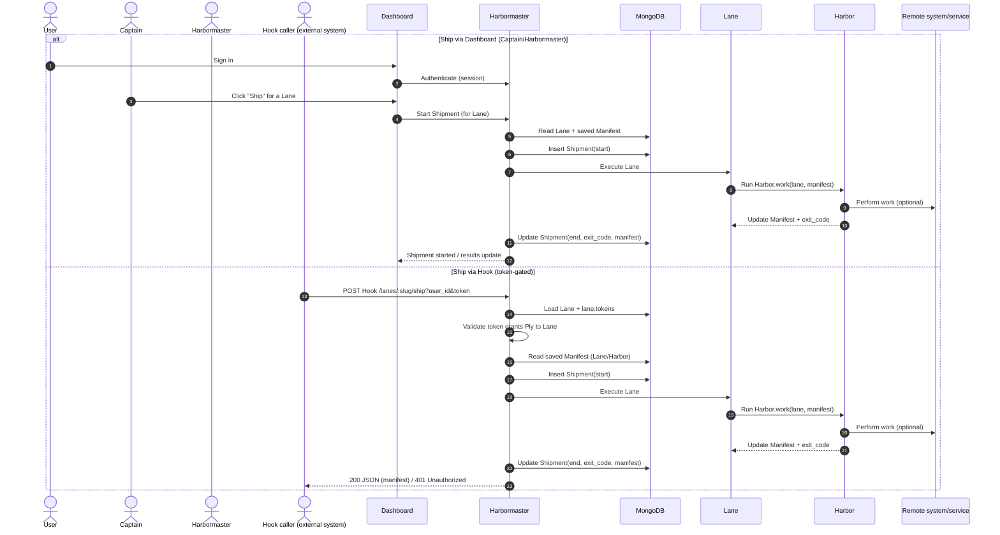
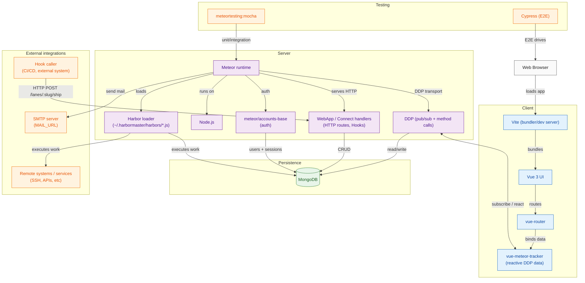

# harbormaster

_n._
1. A framework for microservices.
2. An intelligent pub/sub system.
3. A metaphor for shipping things, such as deployments, or lines of code.
4. The person responsible for one or more of the first three items on this list.

## Outline

- [Purpose](#purpose)
- [Design](#design)
  - [Terms](#terms)
  - [Architecture](#architecture)
  - [Architecture Diagram](#architecture-diagram)
  - [Sequence Diagram](#sequence-diagram)
  - [Systems Diagram](#systems-diagram)
- [Installation](#installation)
  - [Shell](#shell)
  - [Docker](#docker)
- [Usage](#usage)
  - [Dashboard](#dashboard)
  - [Endpoints](#endpoints)
  - [API](#api)

## Purpose

Harbormaster is designed to facilitate the deployment, tracking, and management of discrete services.

A service can be any arbitrary bit of work which generates a value: executing business logic, transforming data, and controlling remote hardware all fall well within the purview of what Harbormaster enables.  Harbormaster facilitates this by encapsulating each discrete service call within a module called a "Harbor", which Harbormaster loads at runtime, and for which Harbormaster provides an API for configuration, execution, and tracking.

Harbors can be as simple or complex as required, using whichever libraries and paradigms are idiomatic to the desired environment or workflow, and can be connected together to create complex workflows while maintaining atomicity, scalability, and maintainability.

In this way, Harbormaster provides a common interface for integrating as many programming paradigms and use cases as it can.

Some examples of harbors include:

- [sleep](https://github.com/strictlyskyler/harbormaster-sleep)
- [ssh](https://github.com/strictlyskyler/harbormaster-ssh)
- [other_lanes](https://github.com/strictlyskyler/harbormaster-other-lanes)

Harbors are meant to be modular, small, and tracked as projects separate from Harbormaster core itself (presented here).

## Design

The core of Harbormaster includes very little other than minimalist administration dashboards and an API for starting chains of execution called "Lanes" and "Charters".  Application-specific logic is left to be implemented as specific Harbors.  There are two key components to understanding how Harbormaster can be used: Terms and Architecture.

### Terms

Here is a list of Terms used to describe some of Harbormaster's components:

- **Harbor**, a discrete unit of work executed by a single Lane, accepting and returning a Manifest for its work containing relevant values
- **Lane**, a stop along the execution path of a Charter, containing a single Harbor, and pointing at an optional followup Lane or Salvage Plan to execute, depending on the results of its Harbor
- **Charter**, an execution path representing a complete set of steps in a workflow, comprised of one or more Lanes
- **Manifest**, passed from lane to lane, containing configuration for a given Harbor and the results of the prior Lane's execution
- **Shipment**, logged each time a Harbor starts and completes its work, containing the result of and metadata about work done
- **User**, anyone who is able to login via the dashboards, edit their own profiles, and view the status of work
- **Captain**, a User who can start Shipments to Lanes they Ply
- **Harbormaster**, an admin User who can invite new Users, Ship to all Lanes, and promote Users to Captains or Harbormasters
- **Followup**, a Lane to execute when the Shipment at a given Harbor has finished
- **Salvage Plan**, a Lane to be executed when a Shipment returns a non-zero code
- **Ply**, the responsibility of Shipping to a Lane
- **Hook**, allowing remote calls to trigger a Shipment via an RPC interface

### Architecture

Harbormaster is written using Meteor, which implies NodeJS, MongoDB, and a few associated packages which can be listed by executing `meteor list` within this repo.  It is designed to adapt to a variety of situations, facilitating good habits when working with service and/or microservice oriented architectures.  Harbormaster is not opinionated about which frameworks, libraries, or external code which is used from within any given Harbor, so long as they are able to work within the context of a Harbor.

When Harbormaster is started it looks within the `~/.harbormaster/harbors` folder for any `.js` files, and loads any it finds in that directory into its runtime.  These files are the entrypoints for any given Harbor, and can execute any arbitrary command required by a Harbor, such as installing dependencies, loading modules, or even modifying Harbormaster's runtime itself.  Harbormaster also watches this directory and will exit any time a file within it changes; restarting it will load the latest version of whichever files exist within this directory.

While Harbormaster doesn't care how any given entrypoint files are added to the `~/.harbormaster/harbors` file, some methods (such as symlinks with docker containers) will not work.  Generally Harbormaster defers to the environment in which it is run to determine whether or not a given means of managing these harbor files will be successful or not.

### Architecture Diagram



### Sequence Diagram



### Systems Diagram



## Installation

Harbormaster can generally be run in two ways: via shell, as with most other servers, or via docker with images built and hosted on Docker Hub.  However you choose to run it, you'll need the following environment variables set for it to work:

```
MAIL_URL=[username]:[password]@[smtp.example.com]:[port]
MONGO_URL=mongodb://[user]:[password]@[mongodb url]:[mongodb port]/[db name, usually "harbormaster"]
ROOT_URL=http[s]://[wherever the app is running][:port]
PORT=[usually 80]
```

### Shell

In its most simplistic form, Harbormaster can be run by cloning the repo and then running `meteor` from within it (you'll need to have Meteor installed to do so).  This is perhaps ideal for development on Harbormaster itself or any particular harbor.

Harbormaster can also be built and run with Meteor's build tools, e.g. `meteor build`.  This will give you a node bundle ready to be deployed and executed wherever you might choose.

### Docker

You can also run Harbormaster via Docker:
```
docker run -d --name harbormaster \
  -e MAIL_URL=[username]:[password]@[smtp.example.com]:[port] \
  -e MONGO_URL=mongodb://[user]:[password]@[mongodb url]:[mongodb port]/[db name, usually "harbormaster"] \
  -e ROOT_URL=http[s]://[wherever the app is running][:port] \
  -e PORT=[usually 80] \
  -p 80:80 \
  -v /path/to/.harbormaster:/root/.harbormaster \
  strictlyskyler/harbormaster:[tag]
```

Currently Harbormaster is not aware of and does not manage how Harbors are loaded into the `~/.harbormaster/harbors` folder.  If it detects a change to one of the indexed `.js` files there, it will exit.

## Usage

There are, broadly, three interfaces for Harbormaster: the **Dashboard**, a simplistic series of HTML pages providing the ability to interact with Harbormaster's Lanes and Users; the **Hooks**, allowing remote triggering of a Lanes via HTTP; and the **API**, which provides programmatic interfaces for Harbors and the database.

### Dashboard

The dashboard provides the ability to administrate Harbormaster visually.  It can be accessed by visiting the `ROOT_URL` variable passed to Harbormaster at runtime in a browser, e.g. `http://localhost`.

It provides a limited walkthrough when Harbormaster is run for the first time, allowing for manual setup of Lanes and Users, as desired.  It provides the ability to setup Lanes and assign work via Harbors, along with a list of all Lanes and their status.  Finally, it provides a Charter for each lane, represented as a visual tree.

Each visual representation is reactive, and reflects the state live as it changes.

### Hooks

Endpoints are available for each Lane, and can be called remotely via HTTP.  Doing so requires both a `token` and `user_id` query parameter to be present, both provided from the Dashboard.  This triggers a shipment to the lane matching the Endpoint.

Calling Hooks can be done like so:

```
# Can be triggered via RPC, e.g.:
curl \
  -f \
  -H "Content-Type: application/json" \
  -X POST \
  -d '{ foo: "bar", baz: "qux" }' \
  [url]/lanes/[lane name]/ship?user_id=[user id who can ply]&token=[generated token for remote triggering]
# Any JSON passed to the optional -d argument will be treated as a prior_manifest for the lane being triggered.
```

A successful start of a shipment returns HTTP code 200 along with the manifest as a JSON string.  Unauthorized access returns 401.

### API

Harbormaster provides an API for starting and ending Shipments from within a Harbor through a few mechanisms.

It passes a reference to the Collections it uses to each Harbor as a part of its Registration: `Lanes, Users, Harbors, Shipments` are arguments passed to each Harbor's `register` method.  These can be referenced later, perhaps during a Harbor's `work` method, for arbitrary updates.

Harbormaster also exposes a global variable, `H`, with methods for starting and stopping shipments:

#### #start_shipment
```
H.start_shipment(lane_id, manifest, start_date);
```
Starts a shipment for a Lane matching the `lane_id` string, with a `manfiest` object containing relevant data, and a canonical `start_date` string to use as reference.  Typically called from a client.

The `start_date` is optional, but if passed, must adhere to the format used by `H.start_date()`.

Triggers a call to the `work` method exposed by the Harbor associated with the Lane being shipped.

#### #end_shipment
```
H.end_shipment(lane_id, exit_code, manifest);
```
Ends a Shipment for a Lane matching the `lane_id` string when its `work` is done.  Expects a number, `exit_code`, representing the success or failure of the work, with `0` as success and anything else as failure.  Accepts any updated `manifest` object representing state to be tracked.  Typically called at the end of a Harbor's `work` method.

#### #start_date
```
H.start_date();
```
Returns a sting matching the format: `YYYY-m-d-HH-mm-ss`.

#### `register`
```
module.exports.register = function (lanes, users, harbors, shipments) {
  // Save a reference to the collections passed here as arguments for later
  // Return an object containing the name of the harbor, along with any npm
  // packages it requires to be available, e.g.:
  // return { name: 'my harbor', pkgs: ['debug', 'lodash'] }
};
```
The `register` method of a Harbor is called during Harbormaster's bootstrap.  It is passed a reference to the core collections Harbormaster uses as arguments, should a Harbor optionally need to use them.  This method is expected to return a `String` representing the name of the Harbor.

#### `next`
```
module.exports.next = function () {
  // Called when Harbor registration succeeds, assign deps, e.g.:
  // fs = require('fs');
}
```
The `next` method of a Harbor is called after Harbormaster has successfully registered that harbor, including installing its dependencies.  This is the expected time to decorate any variables which might be needed for other workflows in the Harbor.

#### `update`
```
module.exports.update = function (lane, values) {
  // If values pass validation, return truthy to save them
  // else return falsey
};
```
The `update` method of a Harbor is called when the user clicks the "Save" button while editing a Lane.  It takes the values present in the rendered input form, and passes them to this method, where validation of the values entered can occur.  If the values are valid, this method should return something truthy, and the values will be saved to the database.  Otherwise if invalid, something falsey should be returned.

#### `render_input`
```
module.exports.render_input = function (values) {
  // Return an HTML string representing any configurable options a user can
  // set in the Harbormaster Dashboard for this Harbor.
}
```
The `render_input` method is called when a Lane is edited, showing the options available for configuring a given Harbor.  It's expected to return a string of HTML to insert in the `<form>` tag on the Edit Lane page.  When a user clicks the "Save" button on an Edit Lane page, any values present in the form will be passed to this method as the `values` argument: an object representing the names and values of the `inputs` and `textareas` on the form.  The form will then be re-rendered.  Form elements need to have a `name` attribute to have their values captured.

#### `render_work_preview`
```
module.exports.render_work_preview = function (manifest) {
  // Return an HTML string briefly describing the work to be done by this
  // particular Harbor.
}
```
The `render_work_preview` method should return a description of the work to be done at a given Harbor, to be displayed on the "Ship" page for any given Lane.  It is purely informational, and meant to sanity-check work to be done before pushing the "Start Shipment" button.

#### `work`
```
module.exports.work = function (lane, manifest) {
  // A given Harbor's work to be done for a given shipment.
  // Requires calling H.end_shipment to mark the Shipment as complete.
}
```
The `work` method of a Harbor, where any given custom logic should go.  Any state to report or save should be assigned as a member on the `manifest` argument passed in, and when work has completed, `H.end_shipment` should be called.

## Contributing
Contributions welcome.  See the `CONTRIBUTING` file present in this repo for guidelines.

## License
GPL 3.0, see `LICENSE` file.


## Build Status

```
LAST UPDATED: Mon Jan 12 07:52:39 PM PST 2026
+---------------------------------+
| All files                       |
| Statements:    100% (3026/3026) |
| Branches  :    100% (528/528)   |
| Functions :    100% (232/232)   |
| Lines     :    100% (3026/3026) |
+---------------------------------+
```
